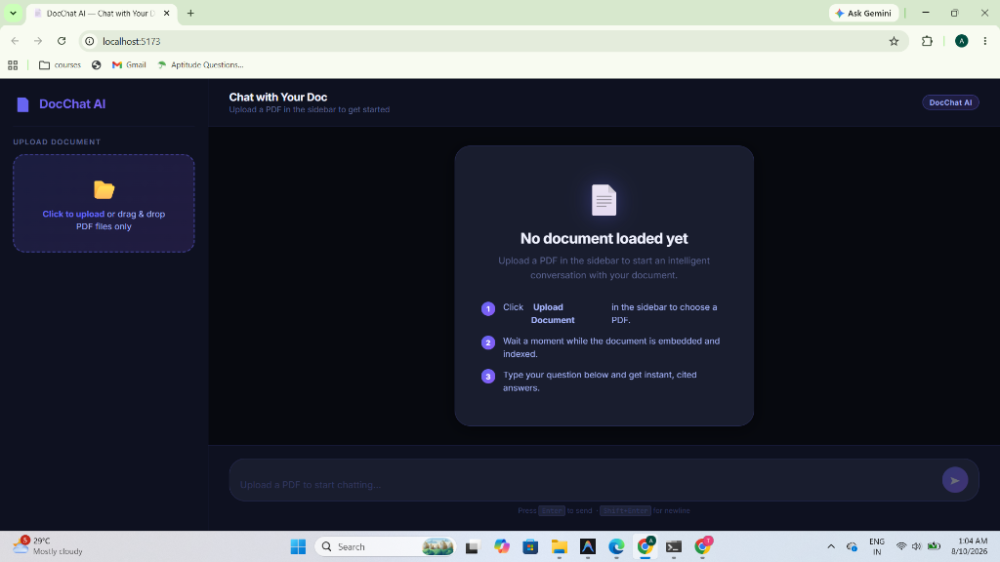
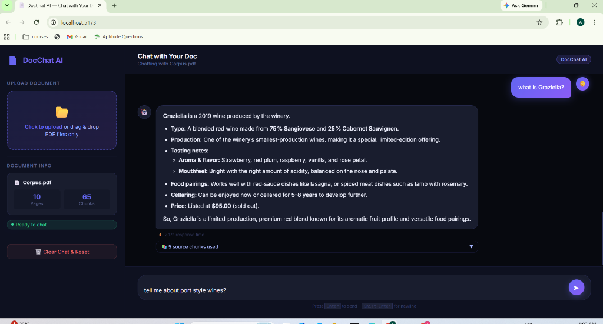
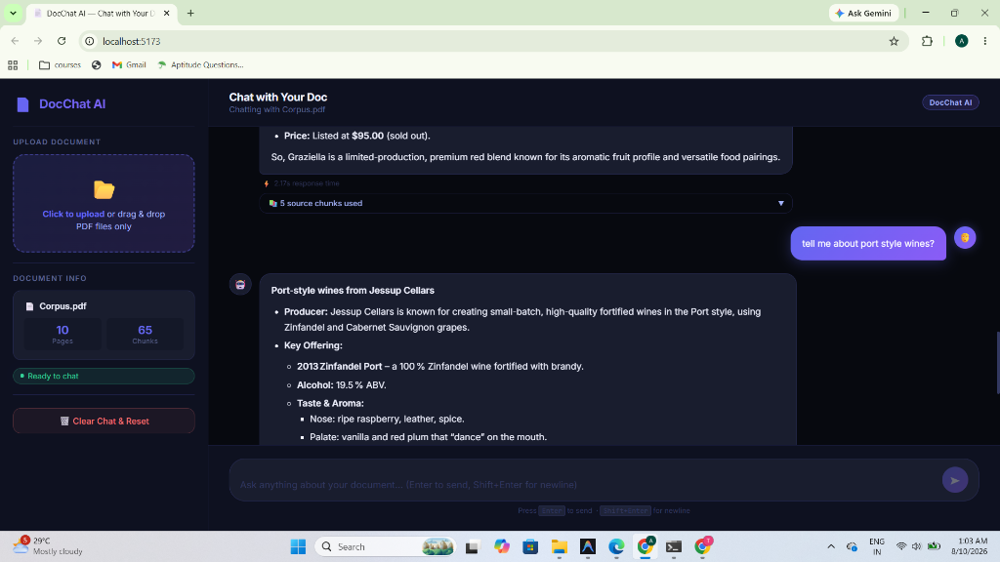
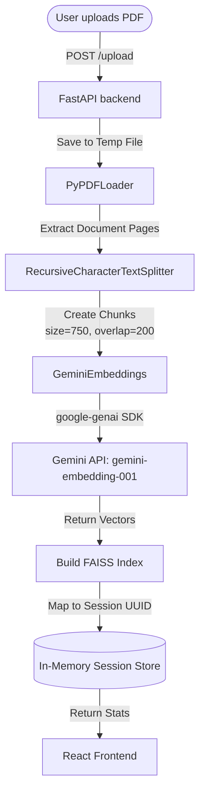
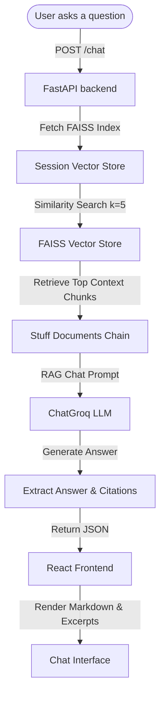

# DocChat AI — Custom PDF Chatbot

DocChat AI is an intelligent, full-stack, RAG (Retrieval-Augmented Generation) document assistant. It allows users to upload a PDF, automatically process and index its contents, and have a conversational chat with the document. 

All generative answers are backed by semantic search citations, showing the exact page numbers and context excerpts used to formulate the response, with execution times displayed in real-time.

## 🖥️ User Interface Preview

### 1. Welcome Screen (No Document Loaded)


### 2. Chat & Source Citations


### 3. Continuous Conversational Flow


---

## 🚀 Key Features

### ⚙️ Backend (FastAPI + LangChain)
- **FastAPI Framework**: High-performance, asynchronous REST API endpoints.
- **Google Gemini Embeddings**: Leverages `gemini-embedding-001` via the official `google-genai` SDK for highly precise vector embeddings.
- **FAISS Vector Store**: Uses Facebook AI Similarity Search (FAISS) in-memory vector storage for ultra-fast, local similarity calculations.
- **Groq LLM Integration**: Leverages ChatGroq's high-speed inference engine for natural, context-grounded responses.
- **State Isolation**: In-memory session tracking utilizing UUIDs to ensure distinct chat histories and document contexts per upload.

### 💻 Frontend (React + Vite)
- **Drag-and-Drop Upload**: Easily drag a PDF onto the sidebar or click to upload.
- **Dynamic Session Statistics**: Instantly view the processed document's name, total pages, and generated text chunks.
- **Rich Markdown Formatting**: Assistant answers support bolding, lists, and tables rendered via `react-markdown` and `remark-gfm`.
- **Interactive Citations Accordion**: Click to inspect the specific document chunks and source pages (e.g., `Page 3`) used by the LLM.
- **Performance Timing**: Real-time response speed tracker (e.g., `⚡ 0.85s response time`).
- **One-Click Reset**: Seamlessly delete the session on both frontend and backend to upload a new document.

---

## 📐 System Architecture & Data Flow

DocChat AI is designed with a decoupled architecture where the Frontend communicates with the Backend via RESTful JSON endpoints. Below are the internal flows for document ingestion and retrieval.

### 1. Document Ingestion (Upload Flow)
When a PDF is uploaded, it is converted into vector representations and stored in an in-memory FAISS database mapping to a unique `session_id`.



### 2. Retrieval-Augmented Generation (Chat Flow)
When a user asks a question, the backend performs a semantic search against the loaded vector index and feeds the most relevant context chunks to the LLM.



---

## 📂 Project Directory Structure

```text
chatbot/
├── Conversational_Chatbot/
│   ├── backend/
│   │   ├── .env                    # Secret API keys configuration
│   │   ├── main.py                 # FastAPI server & route handlers
│   │   ├── rag.py                  # LangChain, FAISS, Gemini Embeddings, & Groq LLM logic
│   │   └── requirements.txt        # Python dependency manifest
│   └── frontend/
│       ├── package.json            # NPM scripts and dependencies
│       ├── vite.config.js          # Vite build config
│       ├── index.html              # HTML entrypoint
│       └── src/
│           ├── main.jsx            # React root mount
│           ├── App.jsx             # Main Application layout & state
│           ├── index.css           # Premium stylesheet & CSS variable palette
│           └── components/
│               ├── Sidebar.jsx     # Upload, Stats, and Reset component
│               ├── ChatWindow.jsx  # Chat messages and Welcome guide container
│               ├── MessageBubble.js# Message rendering, Markdown & Citations Accordion
│               └── ChatInput.jsx   # Input box with keyboard submission
└── Corpus.pdf                      # Sample PDF document
```

---

## 🛠️ Setup & Installation

### 1. Backend Setup
The backend requires access to **Google Gemini API** (for embeddings) and **Groq Cloud API** (for the LLM).

#### Step A: Obtain API Keys
1. **Google Gemini**: Get a free API key at [Google AI Studio](https://aistudio.google.com/).
2. **Groq**: Get an API key at [Groq Console](https://console.groq.com/).

#### Step B: Environment File
Create or update [backend/.env](file:///d:/chatbot/Conversational_Chatbot/backend/.env) inside the backend directory:
```env
GOOGLE_API_KEY="your_gemini_api_key_here"
GROQ_API_KEY="your_groq_api_key_here"
```

#### Step C: Install dependencies & run backend
Ensure you have Python 3.10+ installed.

1. Navigate to the backend directory:
   ```powershell
   cd Conversational_Chatbot/backend
   ```
2. Create and activate a virtual environment:
   ```powershell
   python -m venv env
   # On Windows:
   .\env\Scripts\activate
   # On macOS/Linux:
   source env/bin/activate
   ```
3. Install dependencies from [requirements.txt](file:///d:/chatbot/Conversational_Chatbot/backend/requirements.txt):
   ```powershell
   pip install -r requirements.txt
   ```
4. Start the FastAPI server:
   ```powershell
   uvicorn main:app --reload --port 8000
   ```
   The backend will be running at `http://localhost:8000`. You can visit `http://localhost:8000/docs` to view the interactive Swagger API documentation.

---

### 2. Frontend Setup
The frontend is built using React and Vite.

1. Navigate to the frontend directory:
   ```powershell
   cd ../frontend
   ```
2. Install npm dependencies from [package.json](file:///d:/chatbot/Conversational_Chatbot/frontend/package.json):
   ```powershell
   npm install
   ```
3. Start the Vite development server:
   ```powershell
   npm run dev
   ```
4. Open your browser and navigate to the address shown in the terminal (usually `http://localhost:5173`).

---

## 🔌 API Endpoints Reference

The backend [main.py](file:///d:/chatbot/Conversational_Chatbot/backend/main.py) exposes the following API routes:

| Method | Endpoint | Description | Request Payload | Response |
| :--- | :--- | :--- | :--- | :--- |
| **GET** | `/health` | Check backend server status | None | `{"status": "ok"}` |
| **POST** | `/upload` | Parse PDF, create chunks, embed, and store in FAISS | Form-data: `file` (PDF) | Session UUID, pages count, chunks count |
| **POST** | `/chat` | Retrieve context from FAISS and generate LLM answer | `{"session_id": "...", "question": "..."}` | Answer markdown, source citations, elapsed time |
| **DELETE** | `/session/{session_id}` | Terminate session, purge FAISS vector database from memory | None | `{"detail": "Session deleted."}` |

---

## 🛠️ Technologies Used

### Frontend
- **Framework**: [React.js](https://react.dev/)
- **Build Tool**: [Vite](https://vitejs.dev/)
- **Formatting**: [React Markdown](https://github.com/remarkjs/react-markdown) & [Remark GFM](https://github.com/remarkjs/remark-gfm)
- **Styling**: Vanilla CSS (custom properties, variables, and flexbox grid)

### Backend
- **Framework**: [FastAPI](https://fastapi.tiangolo.com/)
- **RAG Orchestrator**: [LangChain](https://www.langchain.com/) (LangChain Core, LangChain Community, LangChain Text Splitters, LangChain Groq)
- **Vector Database**: [FAISS CPU](https://github.com/facebookresearch/faiss)
- **SDK**: [Google GenAI Python SDK](https://github.com/google/generative-ai-python) (`google-genai` version 1+)
- **Server**: [Uvicorn](https://www.uvicorn.org/)
- **PDF Parser**: `PyPDF` (via `PyPDFLoader`)
